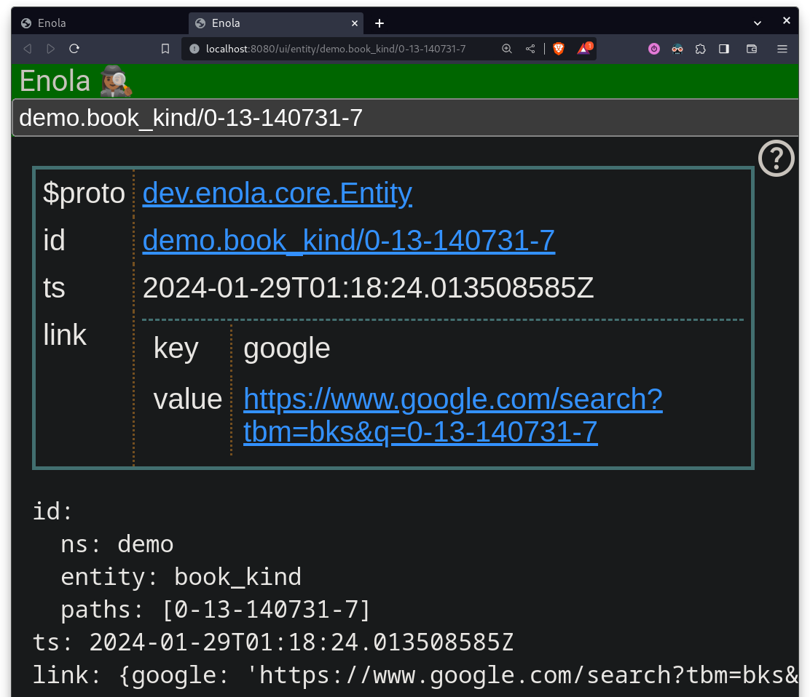

# Thing UI v1 (2024-02-17)

Hello,

It's been a while since [the last post](docgen1.md)! 😼

Enola now has a neat generic UI to display "things" (of any kind really, internally) - and their links. Try out this demo:

1. Download the Enola CLI binary or container, [as documented here](../../use/index.md)

1. Run `./enola server --model https://raw.githubusercontent.com/enola-dev/enola/31c0f0d04dde69e649c7b16fa545baeff2d05524/docs/use/library/model.yaml --httpPort=8080` (or `./enolac ...`) to start Enola with the [example model](../../use/library/index.md)

1. Open http://localhost:8080/ui/demo.book/ABC/0-13-140731-7/1, and you'll see a _Book:_

   

1. Click on the `kind` link, and you'll see its _Book Kind:_

   

1. Click on the `$proto` field to navigate to the `dev.enola.core.Entity` _Proto (Schema),_ and you'll see:

   

1. Click on the `ts` field to navigate to the `google.protobuf.Timestamp`, which is another _Proto Schema,_ and you'll see:

   

Lately I've been reading up more about the Semantic Web, Linked Data, RDF, RDFS, OWL etc.
and I can now see more clearly where the vision of _"Infrastructure as Linked Data"_
that I'm exploring in this project could lead to... watch this space!

Best,

M.
