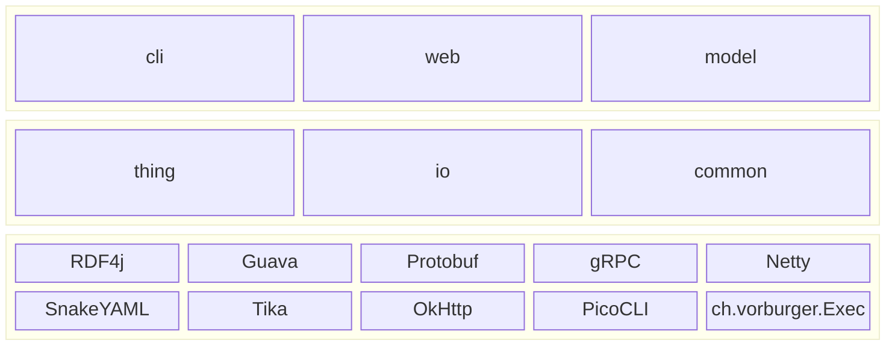
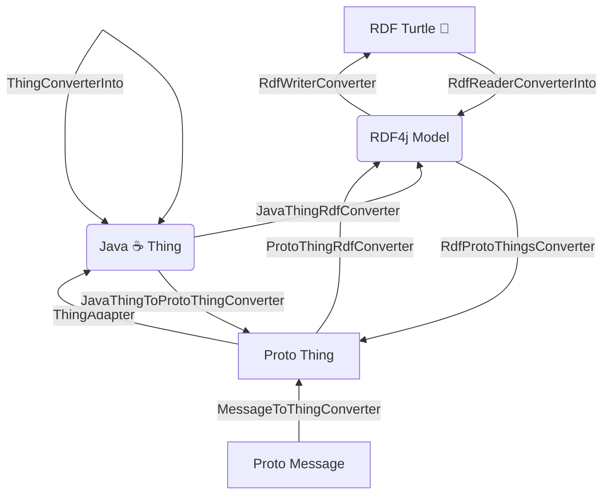

<!--
    SPDX-License-Identifier: Apache-2.0

    Copyright 2024-2026 The Enola <https://enola.dev> Authors

    Licensed under the Apache License, Version 2.0 (the "License");
    you may not use this file except in compliance with the License.
    You may obtain a copy of the License at

        https://www.apache.org/licenses/LICENSE-2.0

    Unless required by applicable law or agreed to in writing, software
    distributed under the License is distributed on an "AS IS" BASIS,
    WITHOUT WARRANTIES OR CONDITIONS OF ANY KIND, either express or implied.
    See the License for the specific language governing permissions and
    limitations under the License.
-->

# Implementation Details

## Modules

<!-- TODO Generate this from a models/enola.dev/modules.ttl ... -->

<!-- TODO When https://github.com/mermaid-js/mermaid/issues/5919 is available, add external links on the third_party block -->

## Enola Thing (ET 👽)

<!-- TODO Generate (some of) this MD from a machine readable RDF models/enola.dev/et.ttl, using Enola itself?! -->

All ETs have 0.. n properties. Each such Property is identified by [an IRI](../concepts/uri.md), and has a value. Each such value has a Type. These types include e.g. text (string), numbers, or dates - but also lists, and “nested" sub-properties. There is actually no fixed set of known such types; applications can define their own.

All ET have an IRI. Note that you may see what looks like an exception to this rule with the “nested” ETs, which RDF and LD call "blank nodes”; in Enola we strictly speaking conceptually don't call those things, just "maps of properties”.

All this is, of course, heavily inspired by [TBL’s vision of the _”Semantic Web"_ of _”Linked
Data”,_](https://www.w3.org/DesignIssues/LinkedData) such as also expressed by standards such as RDF or JSON-LD.

ETs have a number of different (but ultimately semantically equivalent) representations, both internally in Enola's code as well as externally serialized in resources.

### Internal Data Types

#### IRIs

!!! tip "WIP"

    IRIs are (currently) mostly a `String`, but sometimes an `Object`.

    When an IRI is just an `Object`, then its `toString()` is guaranteed to return a valid textual representation of the IRI.

    The intention is to eventually replace all `String` typed IRI with only `Object`.

    This allows for future optimizations of internal IRI types.

#### Wrappers

!!! warning

    This section describes a work-in-progress (WIP) which is not yet fully implemented as documented here.

Enola generates wrapper Java interfaces for RDFS Classes and Properties:

* Generated RDF Property interfaces:
    * by default are named `Has*`_{[Label](https://docs.enola.dev/concepts/metadata/#label)}_ <!-- TODO override how? -->
    * `extends` based on any [`rdfs:subPropertyOf`](../models/www.w3.org/2000/01/rdf-schema/subPropertyOf.md), or `IImmutableThing` (see [Thing](#java--thing))
    * have getter methods with `default` implementations, which delegate to the suitable `Thing.get()` API, using the Property IRI
    * contain an inner `Builder` interface (but no `builder()`, as only used via classes)
* Generated RDF Property Builder interfaces:
    * have setter and `add*` methods with `default` implementations, which delegate to the suitable Thing API, using the Property IRI
* Generated RDF Class interfaces:
    * `extends` all its RDF Property interfaces, as well as any [`rdfs:subClassOf`](../models/www.w3.org/2000/01/rdf-schema/subClassOf.md)
    * by default are named _{[Label](https://docs.enola.dev/concepts/metadata/#label)}_ for classes <!-- TODO override how? -->
    * contain an inner `Builder` interface, and a static `builder()` method to obtain an implementation of it, with `@type` set
    * override `copy()` with a covariant variant type of this class's `Builder`
* Generated RDF Class Builder interfaces:
    * override `iri(Object iri)` and all setters with a covariant variant type of the `Builder` (for chaining)
    * `extends` all its RDF Property Builder interfaces

<!-- TODO Do all classes extend HasType? -->

#### Java ☕ Thing

* Java Type: `dev.enola.thing.Thing` <!-- TODO https://github.com/enola-dev/enola/issues/491: Link to Java Doc -->

The Java `Thing` API is an
_interface_ which has several available implementations. The simplest one is the `dev.enola.thing.impl.ImmutableThing` with its
_Builder._

#### Proto Thing

* Defined in: [`common/thing/thing.proto`](//java/dev/enola/thing/thing.proto)
* Java Type: `dev.enola.thing.proto.Thing` <!-- TODO https://github.com/enola-dev/enola/issues/491: Link to Java Doc -->

#### Proto Message

Any [Protocol Buffer](https://protobuf.dev) can be [converted](#conversions) to a _Thing_ by Enola.

#### RDF4j Model

* Java Type: [`org.eclipse.rdf4j.model.Model`](https://rdf4j.org/javadoc/latest/org/eclipse/rdf4j/model/Model.html)

<!-- TODO #### Java Object: Any `java.lang.Object` can be [converted](#conversions) to a _Thing_ by Enola. -->

### External Serialization Formats

#### RDF Turtle 🐢

* Media Type: `text/turtle`
* Filename extension: `.ttl`
* Wikipedia: [Turtle Syntax](https://en.wikipedia.org/wiki/Turtle_(syntax))
* W3C Spec: [w3.org/TR/turtle](https://www.w3.org/TR/turtle/)
* Example: [picasso.ttl](//test/picasso.ttl)

<!-- TODO #### RDF TriG-star 📐 -->

<!-- TODO #### JSON LD -->

<!-- TODO #### YAML LD -->

<!-- TODO #### Enola own's future Thing YAML format ? -->

#### Proto Thing YAML

* Media Type: `text/enola.dev#thing+yaml` (from `dev.enola.thing.io.ThingMediaTypes`)
* Filename extension: `.thing.yaml`
* Example: [picasso.thing.yaml](//test/picasso.thing.yaml)

#### Proto Thing Text

* Media Type: `text/protobuf?proto-message=dev.enola.thing.Thing` (from `dev.enola.thing.io.ThingMediaTypes`)
* Filename extension: `.textproto`

### Conversions

<!-- Eventually this Mermaid (and also a Graphviz) should also be generated from a machine readable models/enola.dev/et.ttl -->

<!-- TODO Conversion from Java objects, once available -->

### Store & Repository

TODO Document!
